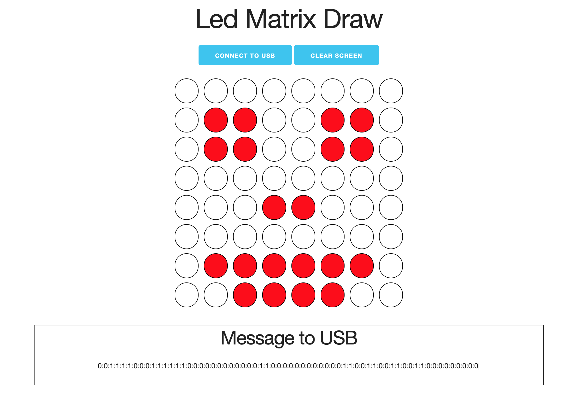
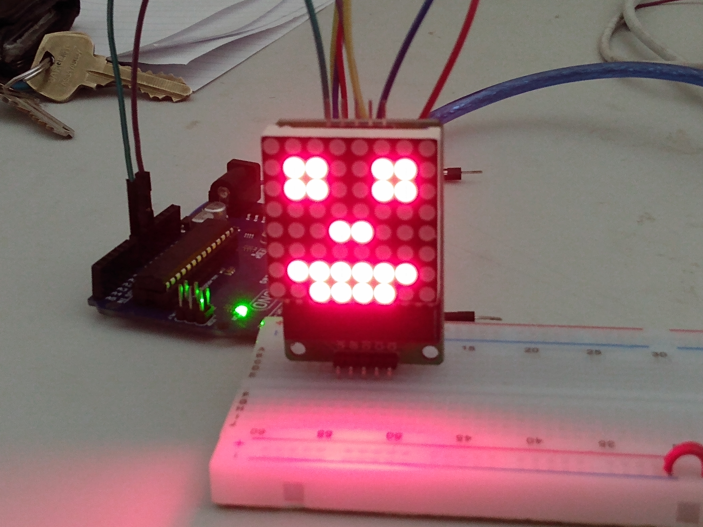
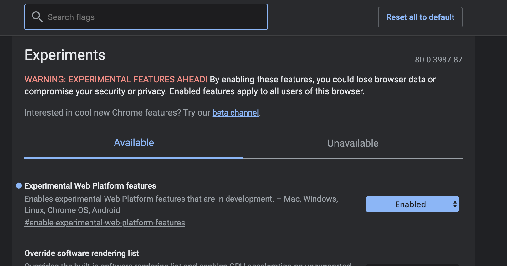
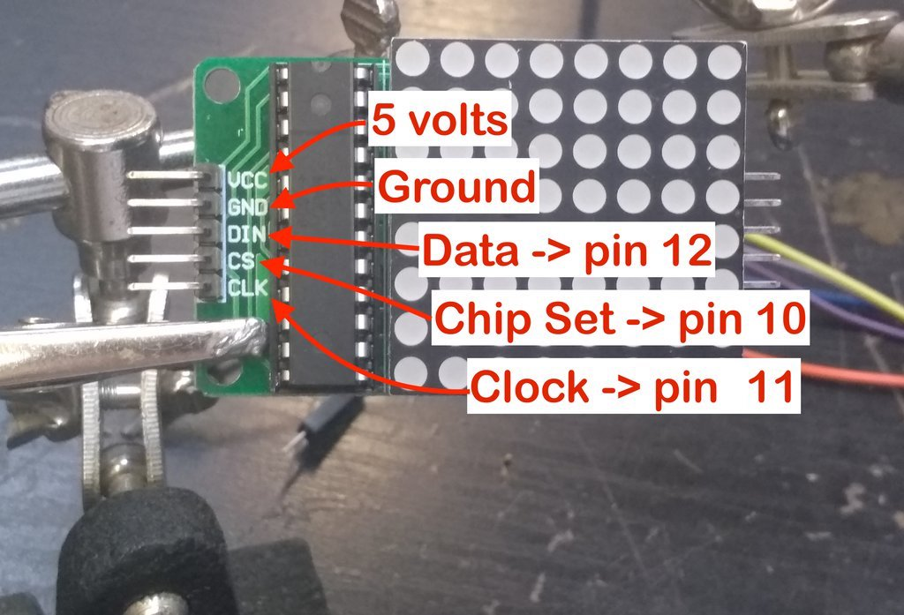
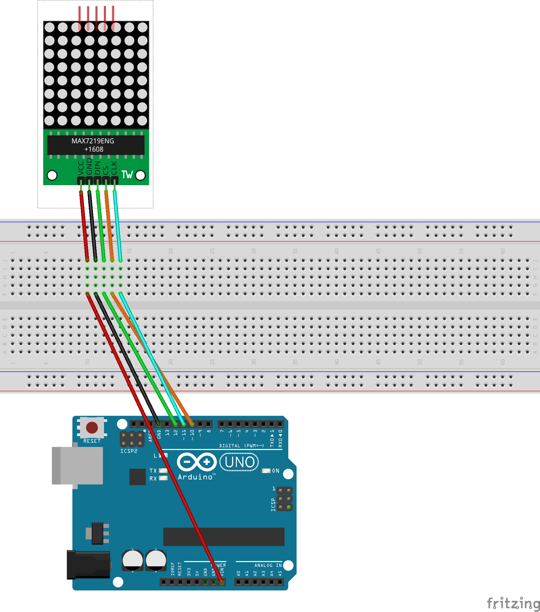

# LED Matrix Chrome Serial Svelte App

## Project 





## Turn on Chrome Serial

Before you begin this tutorial you will need to turn on the experimental version of chrome.  You can do that by going to chrome://flags.  In the future this won't be necessary.  Feel free to turn this off once you are done playing around.  I would recommend that.



## Wiring instructions





1. Wire VCC of Led Matrix to VIN of Arduino.

2. Wire GND of Led Matrix to GND of Arduino.

3. Wire DIN of Led Matrix to pin 12 of Arduino.

4. Wire CS of Led Matrix to pin 10 of Arduino.

5. Wire CLK of Led Matrix to pin 11 of Arduino.

6. Install the led matrix library found in this [tutorial](https://www.instructables.com/id/LED-Matrix-with-Arduino/index.html) you will find the [zip library](https://cdn.instructables.com/ORIG/F79/UC7X/HKCJMPGV/F79UC7XHKCJMPGV.zip) at the bottom of the tutorial.  Once you download it go to sketch -> include library -> add zip in the Arduino IDE.

7. Upload the sketch code below.

8. Go to this [led matrix website](https://phptuts.github.io/svelte-arduino-led-matrix-chrome-serial/).

9. Click the connect button and select your serial port.

10. Have fun!!! :)

## Arduino Sketch

```cpp
#include "LedControlMS.h"
LedControl lc=LedControl(12,11,10,1);


void setup() {
   Serial.begin(115200);
  // put your setup code here, to run once:
 /*
   The MAX72XX is in power-saving mode on startup,
   we have to do a wakeup call
   */
  lc.shutdown(0,false);
  /* Set the brightness to a medium values */
  lc.setIntensity(0,8);
  /* and clear the display */
  lc.clearDisplay(0);
  /** 10 milliseconds is all we need anything else to slow */
  Serial.setTimeout(10);

}

void loop() {
    if (Serial.available() <= 0) {
      return;
    }

    String usbString = Serial.readStringUntil('|');
    Serial.println(usbString);
    if (usbString.indexOf(':') == -1) {
      return;
    }

    if (usbString == "clear") {
      lc.clearDisplay(0);
      return;
    }

    for (int row = 0; row < 8; row += 1) {
      for (int col = 0; col < 8; col += 1) {
         int ledNumber = row * 8 + col;
         bool isOn = getValue(usbString, ':', ledNumber) == "1";
         lc.setLed(0, row, col, isOn);
         // Serial.println(String(row) + " " + String(col) + " " + String(isOn) + " " + getValue(usbString,':', ledNumber));
      }
    }
}

String getValue(String data, char separator, int index)
{
    int found = 0;
    int strIndex[] = { 0, -1 };
    int maxIndex = data.length() - 1;

    for (int i = 0; i <= maxIndex && found <= index; i++) {
        if (data.charAt(i) == separator || i == maxIndex) {
            found++;
            strIndex[0] = strIndex[1] + 1;
            strIndex[1] = (i == maxIndex) ? i+1 : i;
        }
    }
    return found > index ? data.substring(strIndex[0], strIndex[1]) : "";
}
```
